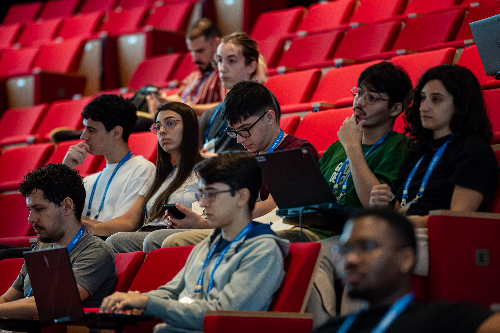
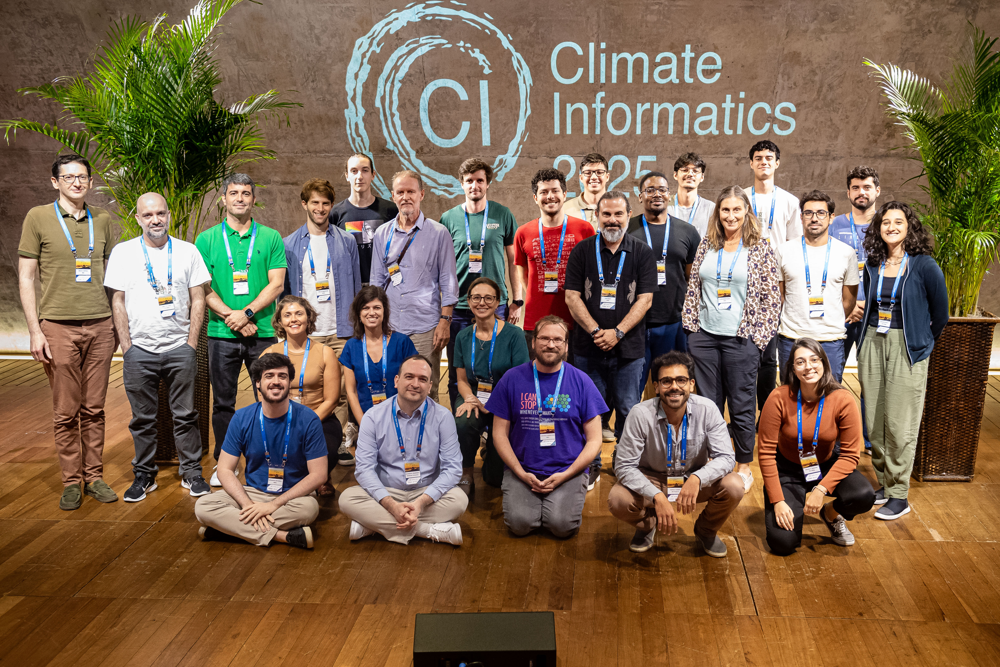
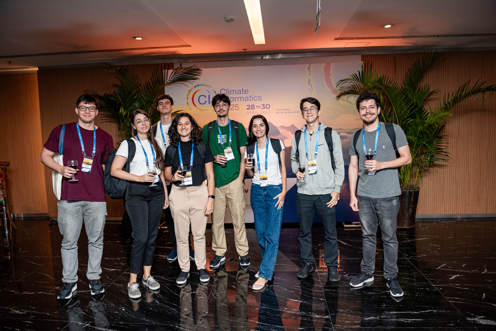
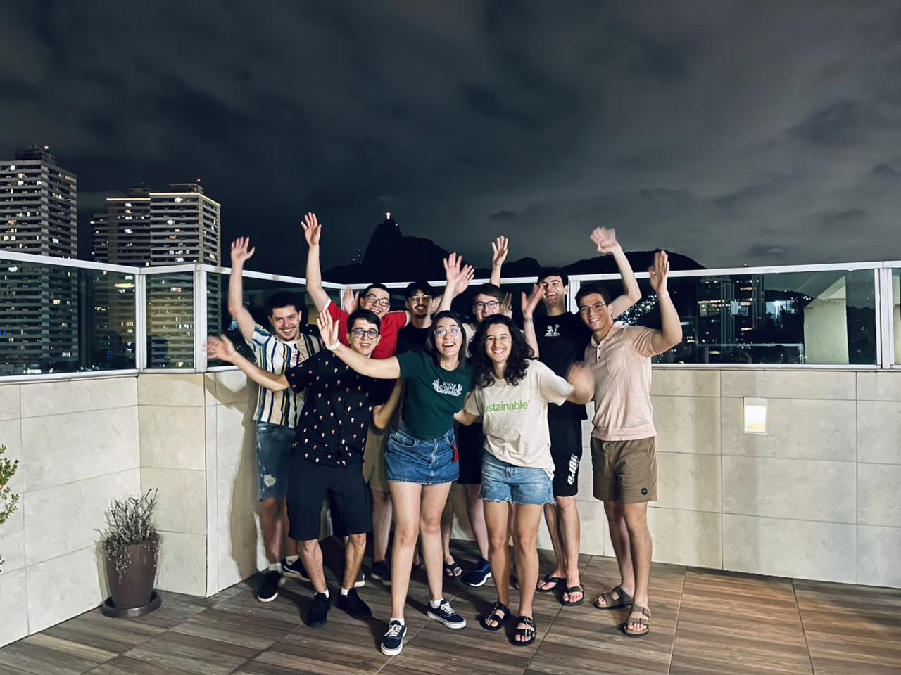

```{=html}
<button class="gallery-thumb" type="button" data-caption="Celebrating the Lab&#x27;s newly minted Master&#x27;s graduates, July 2026"></button>
<button class="gallery-thumb" type="button" data-caption="14th International Conference on Climate Informatics, April 2025"></button>
<button class="gallery-thumb" type="button" data-caption="Closing of the 14th International Conference on Climate Informatics, April 2025"></button>
<button class="gallery-thumb" type="button" data-caption="Laboratory team attending the conference, April 2025"></button>
<button class="gallery-thumb" type="button" data-caption="End-of-year gathering, December 2025"></button>
<button class="gallery-thumb" type="button" data-caption="Same thing, but with hands raised"></button>
```
