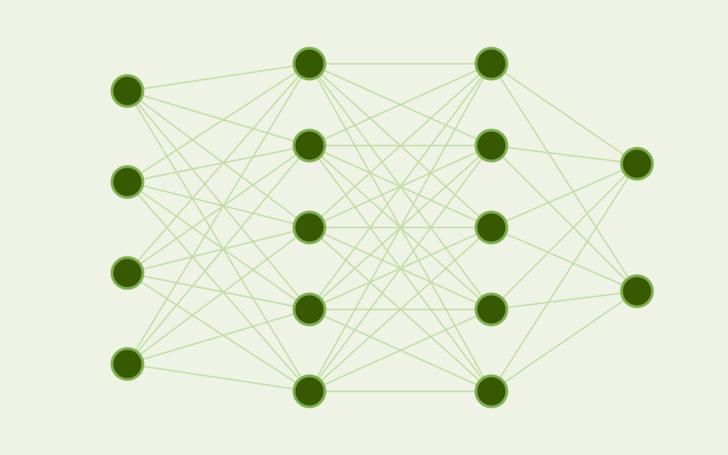
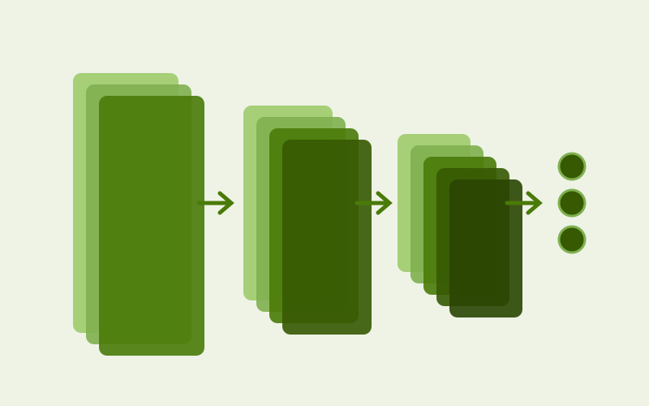

```{=html}
<div class="page-shell">
<div class="page-main">
```

```{=html}
<div class="course-list">

  <div class="course-card">
    
    <div class="course-info">
      <span class="course-level">Graduate Program — EMAp</span>
      <div class="course-title">Neural Networks and Deep Learning</div>
      <ul class="course-details">
        <li><strong>Professor:</strong> Dário Oliveira</li>
        <li><strong>Course load:</strong> 60h</li>
        <li><strong>Classes:</strong> in person, Mondays and Tuesdays, 2:20–4:00 pm (Brasília time)</li>
        <li><strong>Offered:</strong> every second semester</li>
      </ul>
      <a class="pub-btn" href="https://emap.fgv.br/curso/doutorado#aba-disciplinas">Program page</a>
    </div>
  </div>

  <div class="course-card">
    
    <div class="course-info">
      <span class="course-level">Undergraduate — Data Science and AI, EMAp</span>
      <div class="course-title">Deep Learning</div>
      <ul class="course-details">
        <li><strong>Professor:</strong> Dário Oliveira</li>
        <li><strong>Course load:</strong> 60h</li>
        <li><strong>Classes:</strong> in person, Tuesdays and Thursdays, 9:20–11:00 am (Brasília time)</li>
        <li><strong>Offered:</strong> every second semester</li>
      </ul>
      <a class="pub-btn" href="https://emap.fgv.br/curso/ciencia-de-dados-e-inteligencia-artificial#aba-grade-curricular">Course page</a>
    </div>
  </div>

</div>
```

```{=html}
</div>
</div>
```
