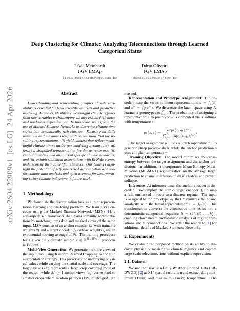

:::: {.pub-detail}

::: {.pub-detail-thumb}
[](https://arxiv.org/abs/2604.22909)
:::

::: {.pub-detail-meta}
**Authors:** Lívia Meinhardt, Dário Oliveira

**Published:** April 2026 — arXiv preprint arXiv:2604.22909

[View on arXiv](https://arxiv.org/abs/2604.22909){.pub-btn}
[Download PDF](https://arxiv.org/pdf/2604.22909){.pub-btn}
:::

::::

## Abstract

Understanding and representing complex climate variability is essential for
both scientific analysis and predictive modeling. However, identifying
meaningful climate regimes from raw variables is challenging, as they exhibit
high noise and nonlinear dependencies. In this work, we explore the use of
Masked Siamese Networks to discretize climate time series into semantically
rich clusters. Focusing on daily minimum and maximum temperature, we show that
the resulting representations: (i) yield clusters that reflect meaningful
climate states under our modeling assumptions, offering a simplified
representation for downstream use; (ii) enable sampling and analysis of
specific climate scenarios; and (iii) exhibit statistical associations with
El Niño events, underscoring their scientific relevance. Our findings
highlight the potential of self-supervised discretization as a tool for
climate data analysis and open avenues for incorporating richer climate
indicators in future work.

## Cite this publication

```bibtex
@misc{meinhardt2026deepclustering,
  title         = {Deep Clustering for Climate: Analyzing Teleconnections
                   through Learned Categorical States},
  author        = {Meinhardt, L{\'i}via and Oliveira, D{\'a}rio},
  year          = {2026},
  eprint        = {2604.22909},
  archivePrefix = {arXiv}
}
```

```{=html}
<a class="back-link" href="/publications/">
  <svg viewBox="0 0 24 24" fill="none" stroke="currentColor" stroke-width="2.2" stroke-linecap="round"><path d="M15 5l-7 7 7 7"/></svg>
  <span>Back to publications</span>
</a>
```
