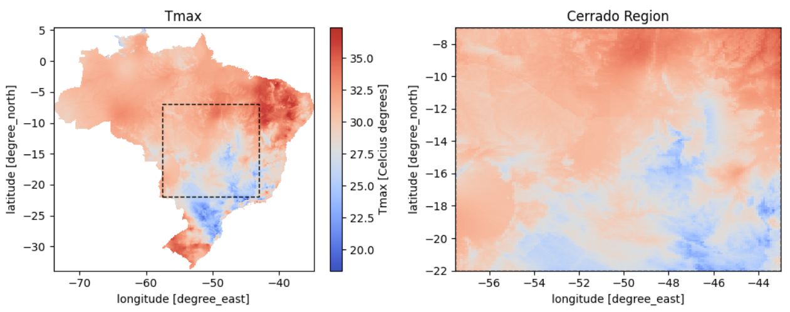

```{=html}
<div class="page-shell">
<div class="page-main">
```

:::: {.pub-detail}

::: {.pub-detail-thumb}
[](https://arxiv.org/abs/2604.22909)
:::

::: {.pub-detail-meta}
**Autores:** Lívia Meinhardt, Dário Oliveira

**Publicação:** Abril de 2026 — arXiv preprint arXiv:2604.22909

[Ver no arXiv](https://arxiv.org/abs/2604.22909){.pub-btn}
[Baixar PDF](https://arxiv.org/pdf/2604.22909){.pub-btn}
:::

::::

## Resumo

Compreender e representar a complexa variabilidade climática é essencial tanto para a análise científica quanto para a modelagem 
preditiva. Contudo, identificar regimes climáticos relevantes a partir de variáveis brutas representa um desafio, uma vez que 
estas apresentam elevado nível de ruído e dependências não lineares. Neste trabalho, investigamos o uso de Redes Siamesas Mascaradas 
(Masked Siamese Networks) para discretizar séries temporais climáticas em agrupamentos (clusters) semanticamente ricos. Com foco 
nas temperaturas diárias mínima e máxima, demonstramos que as representações obtidas: (i) geram clusters que refletem estados 
climáticos consistentes sob as premissas do nosso modelo, oferecendo uma representação simplificada para aplicações futuras; 
(ii) viabilizam a amostragem e a análise de cenários climáticos específicos; e (iii) apresentam associações estatísticas com eventos 
do fenômeno El Niño, reforçando sua relevância científica. Os resultados alcançados destacam o potencial da discretização autossupervisionada 
como ferramenta para a análise de dados climáticos, além de abrir caminhos para a incorporação de indicadores climáticos mais abrangentes em 
trabalhos futuros.


:::: {.pub-figures}


![Análise de probabilidade com defasagem que demonstra a sensibilidade dos regimes aprendidos em defasagens $\tau \in \left[ −12, +12 \right]$ meses em relação ao Índice 
Niño Oceânico. Defasagens negativas indicam comportamento precursor antes do El Niño, enquanto defasagens positivas indicam respostas postergadas após 
o pico do ENOS.](fig2.png)
::::

## Como citar

```bibtex
@misc{meinhardt2026deepclustering,
  title         = {Deep Clustering for Climate: Analyzing Teleconnections
                   through Learned Categorical States},
  author        = {Meinhardt, Lívia and Oliveira, Dário},
  year          = {2026},
  eprint        = {2604.22909},
  archivePrefix = {arXiv}
}
```

```{=html}
<a class="back-link" href="/publications/">
  <svg viewBox="0 0 24 24" fill="none" stroke="currentColor" stroke-width="2.2" stroke-linecap="round"><path d="M15 5l-7 7 7 7"/></svg>
  <span>Voltar para as publicações</span>
</a>
```

```{=html}
</div>
</div>
```
