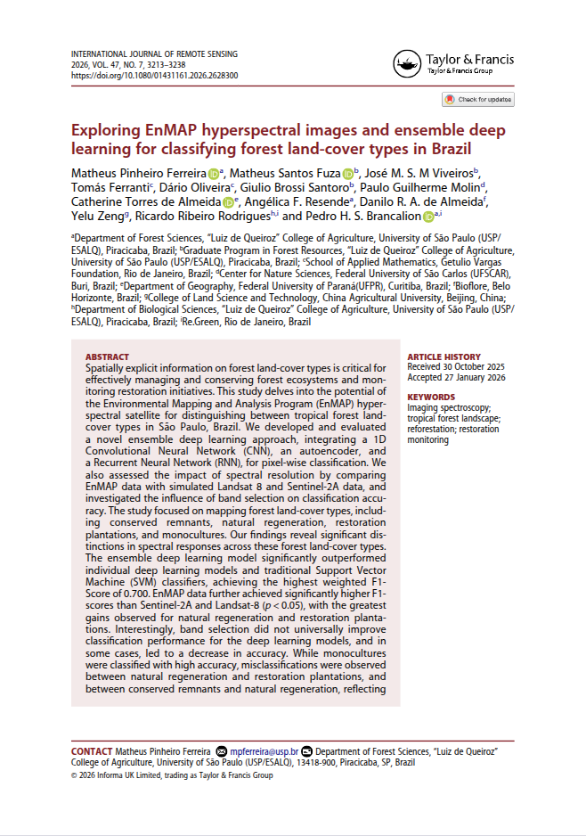

```{=html}
<div class="page-shell">
<div class="page-main">
```

:::: {.pub-detail}

::: {.pub-detail-thumb}
[](https://www.tandfonline.com/doi/figure/10.1080/01431161.2026.2628300?scroll=top&needAccess=true)
:::

::: {.pub-detail-meta}
**Authors:** Matheus Pinheiro Ferreira, Matheus Santos Fuza, José M. S. M. Viveiros, Tomás Ferranti, Dário Oliveira, Giulio Brossi Santoro, Paulo Guilherme Molin, Catherine Torres de Almeida, Angélica F. Resende, Danilo R. A. de Almeida, Yelu Zeng, Ricardo Ribeiro Rodrigues, Pedro H. S. Brancalion

**Published:** April 2026 — International Journal of Remote Sensing, vol. 47, no. 7, pp. 3213–3238 (Taylor & Francis)

[View publication](https://www.tandfonline.com/doi/figure/10.1080/01431161.2026.2628300?scroll=top&needAccess=true){.pub-btn}
[Download PDF](https://www.tandfonline.com/doi/epdf/10.1080/01431161.2026.2628300?needAccess=true){.pub-btn}
:::

::::

## Abstract

Spatially explicit information on forest land-cover types is critical foreffectively managing and conserving 
forest ecosystems and mon-itoring restoration initiatives. This study delves into the potential ofthe Environmental 
Mapping and Analysis Program (EnMAP) hyper-spectral satellite for distinguishing between tropical forest 
land-cover types in São Paulo, Brazil. We developed and evaluateda novel ensemble deep learning approach, 
integrating a 1DConvolutional Neural Network (CNN), an autoencoder, anda Recurrent Neural Network (RNN), for 
pixel-wise classification. Wealso assessed the impact of spectral resolution by comparingEnMAP data with simulated 
Landsat 8 and Sentinel-2A data, andinvestigated the influence of band selection on classification accu-racy. 
The study focused on mapping forest land-cover types, includ-ing conserved remnants, natural regeneration, 
restorationplantations, and monocultures. Our findings reveal significant dis-tinctions in spectral responses 
across these forest land-cover types.The ensemble deep learning model significantly outperformedindividual deep 
learning models and traditional Support VectorMachine (SVM) classifiers, achieving the highest weighted F1-Score 
of 0.700. EnMAP data further achieved significantly higher F1-scores than Sentinel-2A and Landsat-8 (p < 0.05), 
with the greatestgains observed for natural regeneration and restoration planta-tions. Interestingly, band 
selection did not universally improveclassification performance for the deep learning models, and insome cases, 
led to a decrease in accuracy. While monocultureswere classified with high accuracy, misclassifications were 
observedbetween natural regeneration and restoration plantations, andbetween conserved remnants and natural 
regeneration, reflecting their spectral similarities. This study provides valuable insights intothe effective 
use of space-borne hyperspectral imagery and ensem-ble deep learning for robust forest land-cover type mapping 
intropical regions, emphasizing the critical role of high spectral resolution.

:::: {.pub-figures}


::::

## Cite this publication

```bibtex
@article{ferreira2026enmap,
  title     = {Exploring EnMAP hyperspectral images and ensemble deep learning
               for classifying forest land-cover types in Brazil},
  author    = {Pinheiro Ferreira, Matheus and Fuza, Matheus Santos and
               Viveiros, José M. S. M. and Ferranti, Tomáss and
               Oliveira, Dário and Santoro, Giulio Brossi and
               Molin, Paulo Guilherme and de Almeida, Catherine Torres and
               Resende, Angélica F. and de Almeida, Danilo R. A. and
               Zeng, Yelu and Rodrigues, Ricardo Ribeiro and
               Brancalion, Pedro H. S.},
  journal   = {International Journal of Remote Sensing},
  volume    = {47},
  number    = {7},
  pages     = {3213--3238},
  year      = {2026},
  publisher = {Taylor \& Francis}
}
```

```{=html}
<a class="back-link" href="/publications/">
  <svg viewBox="0 0 24 24" fill="none" stroke="currentColor" stroke-width="2.2" stroke-linecap="round"><path d="M15 5l-7 7 7 7"/></svg>
  <span>Back to publications</span>
</a>
```

```{=html}
</div>
</div>
```
