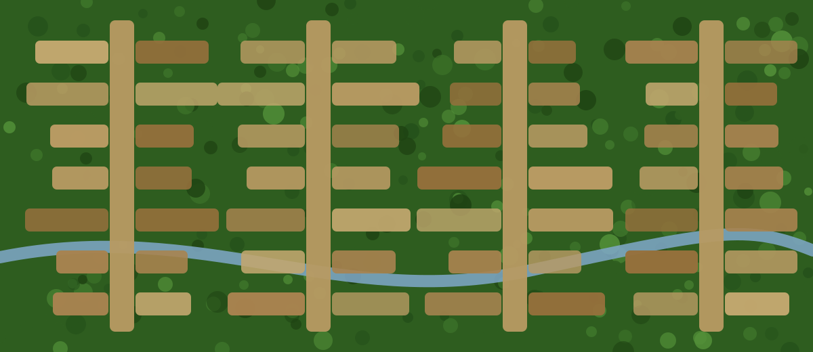

```{=html}
<div class="page-shell">
<div class="page-main">
<p class="rsec-lead reveal">Lorem ipsum dolor sit amet, consectetur adipiscing
elit, sed do eiusmod tempor incididunt ut labore et dolore magna aliqua. Ut
enim ad minim veniam, quis nostrud exercitation ullamco laboris.</p>

<section id="agriculture" class="rsec">
  <div class="rsec-head reveal">
    <div class="rsec-num">01</div>
    <div>
      <span class="rsec-kicker">Research area</span>
      <h2>Agriculture</h2>
    </div>
  </div>
  <p class="rsec-lead reveal">Lorem ipsum dolor sit amet, consectetur
  adipiscing elit, sed do eiusmod tempor incididunt ut labore et dolore magna
  aliqua ut enim ad minim veniam.</p>

  <div class="hscroll-wrap reveal">
    <button class="hscroll-btn prev" aria-label="Previous projects"><svg viewBox="0 0 24 24" fill="none" stroke="currentColor" stroke-width="2.5" stroke-linecap="round"><path d="M15 5l-7 7 7 7"/></svg></button>
    <div class="hscroll">
      <article class="hs-card"><div class="hs-kicker">Project 01</div><div class="hs-title">Lorem ipsum hyperspectral</div><div class="hs-text">Consectetur adipiscing elit, sed do eiusmod tempor incididunt ut labore et dolore.</div></article>
      <article class="hs-card"><div class="hs-kicker">Project 02</div><div class="hs-title">Dolor sit soil and yield</div><div class="hs-text">Ut enim ad minim veniam, quis nostrud exercitation ullamco laboris nisi ut.</div></article>
      <article class="hs-card"><div class="hs-kicker">Project 03</div><div class="hs-title">Amet consectetur pastures</div><div class="hs-text">Duis aute irure dolor in reprehenderit in voluptate velit esse cillum.</div></article>
      <article class="hs-card"><div class="hs-kicker">Project 04</div><div class="hs-title">Tempor incididunt irrigation</div><div class="hs-text">Excepteur sint occaecat cupidatat non proident, sunt in culpa qui officia.</div></article>
      <article class="hs-card"><div class="hs-kicker">Project 05</div><div class="hs-title">Magna aliqua phenology</div><div class="hs-text">Sed ut perspiciatis unde omnis iste natus error sit voluptatem accusantium.</div></article>
    </div>
    <button class="hscroll-btn next" aria-label="Next projects"><svg viewBox="0 0 24 24" fill="none" stroke="currentColor" stroke-width="2.5" stroke-linecap="round"><path d="m9 5 7 7-7 7"/></svg></button>
  </div>
</section>

<section id="forests" class="rsec">
  <div class="rsec-head reveal">
    <div class="rsec-num">02</div>
    <div>
      <span class="rsec-kicker">Research area</span>
      <h2>Forests</h2>
    </div>
  </div>
  <p class="rsec-lead reveal">Lorem ipsum dolor sit amet, consectetur
  adipiscing elit. Drag the divider to compare the same scene at two points in
  time — sed do eiusmod tempor incididunt.</p>

  <div class="compare reveal">
    
    
    <div class="compare-handle"></div>
    <input class="compare-range" type="range" min="0" max="100" value="50" aria-label="Compare before and after">
    <span class="compare-label left">2019</span>
    <span class="compare-label right">2025</span>
  </div>
  <p class="compare-caption reveal">Illustrative simulation — lorem ipsum dolor sit amet, consectetur adipiscing elit.</p>

  <div class="hscroll-wrap reveal">
    <button class="hscroll-btn prev" aria-label="Previous projects"><svg viewBox="0 0 24 24" fill="none" stroke="currentColor" stroke-width="2.5" stroke-linecap="round"><path d="M15 5l-7 7 7 7"/></svg></button>
    <div class="hscroll">
      <article class="hs-card"><div class="hs-kicker">Project 01</div><div class="hs-title">Lorem ipsum deforestation</div><div class="hs-text">Consectetur adipiscing elit, sed do eiusmod tempor incididunt ut labore et dolore.</div></article>
      <article class="hs-card"><div class="hs-kicker">Project 02</div><div class="hs-title">Dolor sit tree species</div><div class="hs-text">Ut enim ad minim veniam, quis nostrud exercitation ullamco laboris nisi ut.</div></article>
      <article class="hs-card"><div class="hs-kicker">Project 03</div><div class="hs-title">Amet consectetur reforestation</div><div class="hs-text">Duis aute irure dolor in reprehenderit in voluptate velit esse cillum.</div></article>
      <article class="hs-card"><div class="hs-kicker">Project 04</div><div class="hs-title">Tempor incididunt biodiversity</div><div class="hs-text">Excepteur sint occaecat cupidatat non proident, sunt in culpa qui officia.</div></article>
    </div>
    <button class="hscroll-btn next" aria-label="Next projects"><svg viewBox="0 0 24 24" fill="none" stroke="currentColor" stroke-width="2.5" stroke-linecap="round"><path d="m9 5 7 7-7 7"/></svg></button>
  </div>
</section>

<section id="climate" class="rsec">
  <div class="rsec-head reveal">
    <div class="rsec-num">03</div>
    <div>
      <span class="rsec-kicker">Research area</span>
      <h2>Climate</h2>
    </div>
  </div>
  <p class="rsec-lead reveal">Lorem ipsum dolor sit amet, consectetur
  adipiscing elit, sed do eiusmod tempor incididunt ut labore et dolore magna
  aliqua.</p>

  <div class="hscroll-wrap reveal">
    <button class="hscroll-btn prev" aria-label="Previous projects"><svg viewBox="0 0 24 24" fill="none" stroke="currentColor" stroke-width="2.5" stroke-linecap="round"><path d="M15 5l-7 7 7 7"/></svg></button>
    <div class="hscroll">
      <article class="hs-card"><div class="hs-kicker">Project 01</div><div class="hs-title">Lorem ipsum extreme events</div><div class="hs-text">Consectetur adipiscing elit, sed do eiusmod tempor incididunt ut labore et dolore.</div></article>
      <article class="hs-card"><div class="hs-kicker">Project 02</div><div class="hs-title">Dolor sit climate series</div><div class="hs-text">Ut enim ad minim veniam, quis nostrud exercitation ullamco laboris nisi ut.</div></article>
      <article class="hs-card"><div class="hs-kicker">Project 03</div><div class="hs-title">Amet consectetur emissions</div><div class="hs-text">Duis aute irure dolor in reprehenderit in voluptate velit esse cillum.</div></article>
      <article class="hs-card"><div class="hs-kicker">Project 04</div><div class="hs-title">Tempor incididunt forecasting</div><div class="hs-text">Excepteur sint occaecat cupidatat non proident, sunt in culpa qui officia.</div></article>
    </div>
    <button class="hscroll-btn next" aria-label="Next projects"><svg viewBox="0 0 24 24" fill="none" stroke="currentColor" stroke-width="2.5" stroke-linecap="round"><path d="m9 5 7 7-7 7"/></svg></button>
  </div>
</section>
</div>
<aside class="side-toc" data-spy aria-label="Contents">
<div class="side-toc-body">
  <div class="side-toc-title">Contents</div>
  <ul>
    <li><a class="side-toc-link" href="#agriculture">Agriculture</a></li>
    <li><a class="side-toc-link" href="#forests">Forests</a></li>
    <li><a class="side-toc-link" href="#climate">Climate</a></li>
  </ul>
</div>
</aside>
</div>
```
